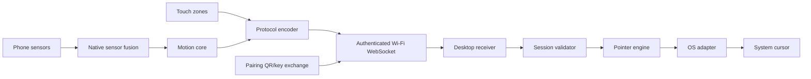

# System Graph

| Component | Inputs / outputs | Dependencies / consumers | Failure modes | Test requirement |
| --- | --- | --- | --- |
| Native sensor fusion | hardware samples → attitude/rate | OS sensor APIs / motion core | unavailable, stale, coordinate mismatch | device matrix + recorded traces |
| Motion core | normalized samples → deltas | calibration/settings / protocol | drift, jitter, invalid time | deterministic unit/property tests |
| Protocol | semantic events ↔ validated messages | schema version / transports | malformed, replayed, unknown version | codec and compatibility tests |
| Transport | messages ↔ bytes | local network, paired keys / receiver | disconnect, latency, captive network | integration/fault injection |
| Receiver/session | bytes → authorized events | protocol, pairing store / pointer engine | spoofing, expiry, ordering | security and integration tests |
| Pointer engine | events → adapter calls | display geometry/settings / adapter | overflow, stale input | unit tests |
| OS adapter | semantic pointer actions → OS events | platform APIs / OS | permission/UIPI/Wayland denial | native integration tests |

Security boundaries: phone↔LAN, receiver↔pointer engine, adapter↔OS. Platform boundaries: sensor host, desktop adapter. On loss, connection, authorization, or freshness, the receiver releases any held button and stops movement.
